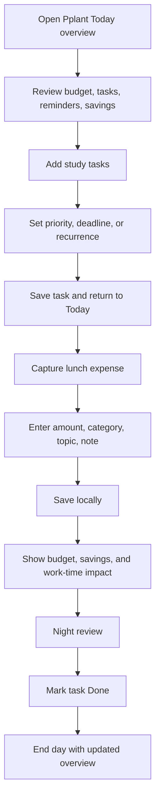
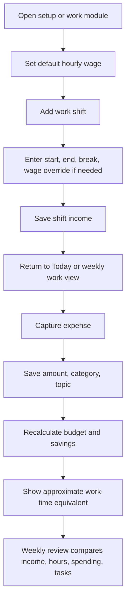
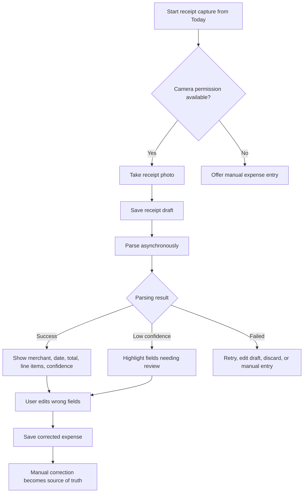
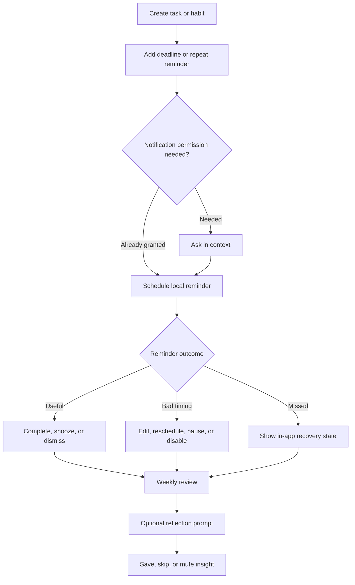

---
stepsCompleted:
  - 1
  - 2
  - 3
  - 4
  - 5
  - 6
  - 7
  - 8
  - 9
  - 10
  - 11
  - 12
  - 13
  - 14
lastStep: 14
inputDocuments:
  - _bmad-output/planning-artifacts/prd.md
  - _bmad-output/planning-artifacts/prd-validation-report.md
  - _bmad-output/planning-artifacts/product-brief-Pplant.md
  - _bmad-output/planning-artifacts/product-brief-Pplant-distillate.md
  - DESIGN.md
workflowType: ux-design
projectName: Pplant
created: 2026-05-07
documentOutputLanguage: English
---

# UX Design Specification Pplant

**Author:** Tqlin
**Date:** 2026-05-07

---

<!-- UX design content will be appended sequentially through collaborative workflow steps -->

## Executive Summary

### Project Vision

Pplant is a mobile-first student-life planner that helps students understand their week through money, time, work income, tasks, reminders, savings, and reflection. The UX should make the daily loop feel calm and lightweight: open the overview, capture what happened, adjust plans, and review patterns without shame or over-analysis.

### Target Users

Primary users are students managing allowance, part-time income, study tasks, reminders, and everyday spending. They may feel anxious about money or productivity but do not want a complex finance dashboard. They need fast capture, clear feedback, recoverable correction flows, and gentle reminders that fit normal student routines.

### Key Design Challenges

- Combining money, work hours, tasks, reminders, savings, and reflection without making the home screen feel crowded.
- Designing trust-sensitive receipt correction so OCR feels assistive, visible, and recoverable rather than magical or brittle.
- Keeping reflection-only insights neutral: no causal claims, prediction, optimization, or financial-advice tone.
- Supporting recurring items and reminders with enough control while keeping MVP recurrence understandable.
- Applying the `DESIGN.md` editorial visual system to a dense mobile app surface without turning it into a marketing page.

### Design Opportunities

- Create a distinctive combined daily overview that becomes the student's "Do I have enough money, time, and attention this week?" checkpoint.
- Translate expenses into work-time context to deliver the core aha moment without shaming the user.
- Make correction, offline drafts, missed reminders, and low-confidence states feel calm and recoverable.
- Use restrained editorial UI patterns, clear typography, and signature color moments to make the app feel mature, focused, and personal.

## Core User Experience

### Defining Experience

The defining experience is the daily overview as a student-life checkpoint. Users should quickly answer: "Do I still have enough money, time, and attention for this week?" From that overview, they can capture an expense, add a task, log work income, set a reminder, or review progress without switching mental contexts.

### Platform Strategy

Pplant is mobile-first. The MVP UX should assume touch interaction, short sessions, camera-based receipt capture, local notifications, offline or poor-network capture, and one-handed daily use. The UX should prioritize mobile ergonomics over desktop-style dashboards.

### Effortless Interactions

- Start expense capture, task creation, work-entry logging, or reminder setup from the daily overview.
- Correct receipt parsing without restarting the expense flow.
- See spending impact as remaining budget, savings effect, and work-time equivalent.
- Pause, skip, reschedule, or recover missed reminders without shame.
- Save drafts and recover interrupted forms after camera cancellation, app backgrounding, or network loss.

### Critical Success Moments

- The user opens the home overview and immediately understands today's money, tasks, reminders, savings, and work-income context.
- A receipt scan is wrong, but correction is visible, fast, and recoverable.
- A small purchase becomes meaningful because the user sees its work-time equivalent.
- A missed reminder feels recoverable rather than punitive.
- A weekly reflection helps the user notice patterns without causal claims or judgment.

### Experience Principles

- One calm overview beats separate finance and task dashboards.
- Capture should start quickly; correction should preserve trust.
- Reflection shows relationships, not blame or prediction.
- Every error, missed task, offline state, and low-confidence state needs a clear next action.
- Visual design should follow `DESIGN.md`: white canvas, dark ink, editorial spacing, restrained controls, and signature color moments used sparingly.

## Desired Emotional Response

### Primary Emotional Goals

Pplant should make users feel calm, clear, and capable. The product should reduce anxiety around spending, missed tasks, receipt errors, and reminder fatigue by making every state recoverable and every insight non-judgmental.

The primary emotional goal is: "I understand my week better, and I can adjust one small thing."

### Emotional Journey Mapping

- First discovery: users should feel that Pplant is lighter and more personal than a finance dashboard or productivity app.
- First daily overview: users should feel oriented, not overwhelmed.
- Capture moment: users should feel that recording money, work, tasks, or reminders is low-friction.
- Receipt correction: users should feel trust because errors are visible and fixable.
- Missed reminder or task: users should feel recovery, not punishment.
- Weekly/monthly review: users should feel reflective clarity without causal claims, prediction, or blame.
- Return use: users should feel that Pplant fits into routine rather than demanding a new lifestyle.

### Micro-Emotions

- Confidence over confusion.
- Trust over skepticism.
- Calm focus over financial anxiety.
- Accomplishment over guilt.
- Gentle awareness over self-judgment.
- Progress over perfection.

### Design Implications

- Calm control requires visible next actions for empty, failed, offline, low-confidence, and missed states.
- Trust requires source labels for manual, parsed, estimated, and low-confidence values.
- Non-shaming reflection requires neutral copy and optional prompts.
- Confidence requires the daily overview to prioritize the few things that matter today instead of exposing every metric at once.
- Recovery requires drafts, undo-like affordances, retry/edit/discard options, and reminder pause/reschedule controls.
- Delight should come from useful context, such as work-time equivalents and savings impact, not decorative animation.

### Emotional Design Principles

- Never make the user feel judged for spending, missing tasks, or ignoring reminders.
- Every error state should say, implicitly, "you can fix this."
- Reflection should invite user-authored meaning rather than provide app-authored blame.
- The UI should feel mature, quiet, and organized, with signature color moments reserved for meaningful transitions or summaries.
- The app should reward consistency gently, not demand perfection.

## UX Pattern Analysis & Inspiration

### Inspiring Products Analysis

**Structured / visual daily planners**
Structured-style planners are useful inspiration for turning a day into a clear timeline without making planning feel heavy. The transferable pattern is a calm "today" view where scheduled items, tasks, and reminders appear in a single rhythm. For Pplant, this supports the daily overview and helps money/task/work context feel like part of the same day rather than separate modules.

**Todoist / task management**
Todoist is useful for capture, prioritization, due dates, and recovery from overdue tasks. The transferable pattern is fast task entry with simple metadata and clear list states. For Pplant, the lesson is to keep task creation and reminder setup lightweight, with missed items presented as recoverable rather than punitive.

**Habitify / Streaks-style habit trackers**
Habit trackers are useful for completion feedback, recurring behavior, and lightweight progress review. The transferable pattern is simple recurrence, completion-by-day, and visual continuity over time. For Pplant, this should be adapted carefully: progress should encourage consistency without guilt, and recurrence should stay bounded to daily, weekly, and monthly MVP rules.

### Transferable UX Patterns

- A single "Today" surface that combines upcoming items, recent activity, and progress.
- One primary capture action that branches into expense, task, work entry, and reminder creation.
- Lightweight metadata entry: priority, deadline, amount, category, topic, wage, or recurrence should appear only when relevant.
- Recovery-first overdue and missed states with actions such as complete, snooze, reschedule, pause, skip, or dismiss.
- Habit/recurrence feedback that shows continuity without making streak loss feel like failure.
- Weekly review patterns that summarize behavior and invite reflection rather than delivering judgment.

### Anti-Patterns to Avoid

- Finance dashboards that expose too many charts before users understand what action to take.
- Habit streak mechanics that shame users when they miss a day.
- Task apps that let overdue items pile up without a gentle recovery path.
- Receipt scanning flows that hide uncertainty or force users to restart after one wrong field.
- Planner layouts that separate money, work, tasks, and reminders so users must mentally connect them.
- Over-personalized insights that imply causation or financial advice.

### Design Inspiration Strategy

**Adopt:**

- Today-first planning from student planner apps.
- Fast capture and clean metadata from task apps.
- Gentle recurrence and completion patterns from habit apps.

**Adapt:**

- Habit streaks should become soft continuity signals, not pressure mechanics.
- Task overdue states should become recovery prompts, not failure states.
- Timeline planning should include money and work context without becoming a calendar clone.

**Avoid:**

- Heavy dashboards, punitive streaks, hidden OCR uncertainty, causal insight language, and any pattern that makes the user feel judged.

## Design System Foundation

### 1.1 Design System Choice

Pplant should use a token-led custom mobile design system based on `DESIGN.md`, supported by platform-appropriate mobile component primitives during implementation.

The design system should preserve the documented visual direction: white canvas, dark ink typography, restrained controls, editorial spacing, hairline borders, modest typography weights, and signature color surfaces used sparingly for meaningful moments.

### Rationale for Selection

A fully generic established system would make Pplant feel like a finance dashboard or productivity template. A fully custom system would create unnecessary design and implementation cost. A token-led themeable approach gives the product a distinct visual identity while keeping components practical, accessible, and maintainable.

This choice fits Pplant because the app needs:

- Mobile-first ergonomics for short daily sessions.
- Dense but calm information surfaces.
- Trust-sensitive flows for receipt correction, reminders, and reflection.
- A mature visual tone that avoids gamified shame or childish student-app styling.
- Consistency with `DESIGN.md` as the source of truth.

### Implementation Approach

The UX specification should define components at the pattern/token level rather than prescribing a specific frontend library. Implementation may later choose the best mobile stack, but UI components should map back to these product-level primitives:

- Daily overview sections
- Capture action controls
- Form fields and correction fields
- Bottom sheets and confirmation dialogs
- Reminder recovery controls
- Reflection prompts
- Category/topic selectors
- Receipt parsing state indicators
- Summary cards and signature insight surfaces

### Customization Strategy

`DESIGN.md` should be adapted for Pplant as follows:

- Use white canvas and dark ink as the default app atmosphere.
- Use signature coral, forest, cream, peach, mint, yellow, and dark surfaces only for summaries, insight moments, or high-salience states.
- Keep primary actions near-black and restrained.
- Prefer hairline borders, clean spacing, and compact editorial hierarchy over decorative shadows.
- Avoid marketing-page hero patterns inside the app.
- Keep cards functional and limited to actual grouped content, repeated items, modals, and summary modules.
- Maintain neutral, non-shaming copy across reminders, missed tasks, budget status, receipt errors, and reflections.

## 2. Core User Experience

### 2.1 Defining Experience

The defining experience is contextual capture: users record one real-life event from the daily overview and immediately see its meaning in the broader student-life loop.

A captured event may be an expense, income entry, work shift, task, reminder, receipt, or reflection. The UX should make capture feel lightweight, then return users to an updated overview that shows relevant impact: remaining budget, savings progress, work-time equivalent, task progress, reminder state, or review context.

The user-facing description should be: "I add what happened, and Pplant shows what it means for my week."

### 2.2 User Mental Model

Users currently think in separate tools: money app for spending, task app for assignments, notes app for reminders, memory for work hours. Pplant should shift the mental model from separate logs to one daily loop.

Users expect:

- Capture to be fast and forgiving.
- Today's view to answer what needs attention now.
- Corrections to be possible after any automated help.
- Summaries to explain context without blaming them.
- Missed items to remain recoverable.

Likely confusion points:

- Whether categories and topics mean different things.
- Whether receipt parsing is final or editable.
- Whether recurring items create future records automatically.
- Whether reflection insights are advice or neutral context.

### 2.3 Success Criteria

The defining experience succeeds when:

- Users can start primary capture actions from the daily overview in no more than two taps.
- After saving, users return to an updated context instead of a dead-end confirmation screen.
- Receipt correction preserves draft/photo context and avoids forcing restart.
- Impact feedback is specific but calm: amount, remaining budget, savings effect, work-time equivalent, task/reminder state, or reflection context.
- Missed, offline, failed, and low-confidence states always provide clear recovery actions.
- No flow implies blame, causal certainty, prediction, or financial advice.

### 2.4 Novel UX Patterns

Pplant mostly combines familiar patterns in a new way rather than requiring a novel interaction users must learn.

Established patterns to use:

- Today overview from planner apps.
- Fast add/capture from task apps.
- Receipt review and correction from expense apps.
- Completion-by-day from habit apps.
- Recovery controls from reminder/task systems.

Unique twist:

- Every capture returns to connected context across money, work time, savings, tasks, reminders, and reflection.
- Insights are reflection-first, not recommendation-first.
- Work-time equivalents translate spending into effort without shame.

### 2.5 Experience Mechanics

**1. Initiation**

Users start from the daily overview. Primary capture controls should be visible without searching and should branch into expense, receipt, task, work entry, and reminder flows.

**2. Interaction**

Each capture flow should ask only for required information first, then reveal optional metadata such as category, topic, priority, recurrence, wage, notes, or receipt line items when relevant.

**3. Feedback**

After user input, Pplant should show immediate context:

- Expense: remaining budget, category/topic, savings effect, work-time equivalent.
- Work entry: earned income, hours, wage snapshot, weekly work-income view.
- Task/reminder: state, deadline, recovery action, daily progress.
- Receipt: parsing state, low-confidence fields, correction status.
- Reflection: selected period, relationships shown, user-authored note.

**4. Completion**

Completion returns users to the daily overview or relevant review surface with the updated item visible. Confirmation should be quiet and action-oriented, not celebratory in a way that pressures behavior.

## Visual Design Foundation

### Color System

Pplant should use `DESIGN.md` as the visual source of truth.

Default app surfaces should use:

- Canvas: white as the primary app background.
- Ink: near-black for primary text, key numbers, primary icons, and main actions.
- Body and muted text: dark gray tones for supporting labels, metadata, secondary values, and helper copy.
- Hairline borders: light gray borders for cards, inputs, separators, correction fields, and list rows.
- Surface soft / strong: light gray surfaces for grouped modules, inactive states, and quiet summary regions.

Signature colors should be used sparingly:

- Signature coral: high-salience spending, budget drift, or warning-adjacent reflection moments, without alarmist styling.
- Signature forest: savings progress, stable habits, or positive continuity.
- Signature cream: weekly/monthly reflection surfaces and gentle prompts.
- Signature peach/mint/yellow/mustard: small context chips, category/topic accents, or lightweight summary fragments.
- Surface dark: major summary or review moments where focus and contrast are needed.

The app should avoid one-note color dominance. Most screens should read as white canvas with dark ink and controlled color accents.

### Typography System

Pplant should follow the `DESIGN.md` typography direction: Haas-style grotesk typography with modest weights and no negative letter spacing. If Haas is unavailable, Inter / system-ui may be used as implementation substitutes.

Mobile typography should prioritize clarity and scanning:

- Screen title: 24-32px, regular or medium weight.
- Section title: 18-20px, medium weight.
- Body text: 14-16px, regular weight.
- Metadata and helper labels: 13-14px, regular or medium weight.
- Key amounts and progress values: 24-32px, regular or medium weight, never over-bolded.
- Button labels: 16px medium weight.

The app should not use hero-scale marketing typography inside dense product screens. Large type is reserved for overview anchors, weekly/monthly summaries, and focused review moments.

### Spacing & Layout Foundation

Pplant should use a 4px spacing base with mobile-friendly groupings:

- 4px: tight icon/text relationships.
- 8px: label/value relationships.
- 12px: compact row spacing.
- 16px: default internal padding for list items and controls.
- 24px: section spacing within screens.
- 32px: major screen group spacing.
- 48px+: reserved for review or empty-state breathing room.

The mobile layout should be dense but calm:

- Use one primary scroll surface per screen.
- Prefer full-width sections and functional modules over nested cards.
- Use cards only for grouped content, repeated items, bottom sheets, dialogs, and summaries.
- Keep daily overview modules scannable, with stable dimensions so dynamic content does not shift layout.
- Use bottom sheets for focused capture, correction, recurrence setup, and reminder recovery.
- Use tab or bottom navigation only for major app zones, not for every feature.

### Accessibility Considerations

Pplant should meet WCAG 2.2 AA where applicable for mobile experiences.

Accessibility requirements:

- Primary touch targets should be at least 44x44 px.
- Text scaling must not hide required fields, actions, or correction controls.
- Budget status, task state, reminder state, receipt confidence, and savings progress must not rely on color alone.
- Inputs, icon buttons, chips, tabs, and capture actions must have clear labels.
- Error, failed, offline, low-confidence, and permission-denied states must provide a visible next action.
- Motion should be minimal and non-essential; useful context should never depend on animation.
- Copy should remain neutral and non-shaming across all states.

## Design Direction Decision

### Design Directions Explored

We explored eight mobile UX directions: Calm Daily Checkpoint, Day Timeline Ledger, Capture-First Bottom Sheet, Weekly Reflection Magazine, Trust-First Receipt Desk, Compact Student OS, Work-Time Lens, and Recovery-First Planner.

### Chosen Direction

Pplant should use Calm Daily Checkpoint as the primary design direction, supported by Capture-First Bottom Sheet, Trust-First Receipt Desk, Weekly Reflection Magazine, Work-Time Lens, and Recovery-First Planner patterns where those flows are most relevant.

### Design Rationale

This direction best supports the product promise: one calm daily overview where students understand money, time, attention, reminders, and capture without opening separate dashboards. It aligns with `DESIGN.md` through white canvas, dark ink, restrained controls, hairline borders, modest typography, and sparse signature color moments.

### Implementation Approach

The MVP should prioritize a Today overview as the default home surface, with fast capture branching into expense, receipt, task, work, and reminder flows. Receipt parsing should use visible confidence and correction states. Weekly/monthly reviews should use editorial reflection surfaces. Spending should include work-time context without advice or judgment. Missed, offline, failed, paused, and low-confidence states should always provide calm recovery actions.

## User Journey Flows

### Journey 1: Daily Planning And Quick Capture

Mai starts from the Today overview, plans tasks, sets a reminder, records a lunch expense, and returns at night to mark progress. The flow should make the combined daily loop feel like one calm checkpoint rather than separate finance and task modules.

### Journey 2: Work-Time Spending Context

An records wage and work shifts, then logs purchases and sees spending in budget, savings, and work-time terms. The flow must avoid advice language and keep the work-time equivalent as context.

### Journey 3: Receipt Capture And Trust-Preserving Correction

Linh captures a receipt, reviews parsed fields, corrects errors, and saves without restarting. The core UX requirement is visible uncertainty and user correction as the source of truth.

### Journey 4: Reminder Recovery And Reflection

Minh creates repeat reminders, adjusts noisy timing, recovers missed items, and completes a weekly reflection. The flow should protect notification trust through calm controls and non-shaming language.

### Journey Patterns

- Today overview is the primary entry point for planning, capture, recovery, and review.
- Capture flows should save drafts early, persist locally, and return users to updated context.
- User-edited values take precedence over parsed, estimated, or derived values.
- Bottom sheets should handle focused creation and correction without forcing navigation away from the daily loop.
- Recovery states should always offer a next action: retry, edit, snooze, pause, reschedule, save manually, discard, or keep draft.
- Weekly/monthly review should show relationships as reflection, not causation, prediction, optimization, or financial advice.

### Flow Optimization Principles

- Keep primary capture actions within two taps from the Today overview.
- Ask only for required information first, then reveal optional metadata such as topic, recurrence, wage override, or line items.
- Show immediate feedback after save: budget remaining, savings effect, work-time equivalent, task state, reminder state, or review context.
- Use calm, neutral language for overspending, missed tasks, reminder fatigue, failed parsing, and low-confidence states.
- Preserve user trust by making uncertainty visible and making every interrupted or failed flow recoverable.

## Component Strategy

### Design System Components

Pplant should use a token-led custom mobile component system based on `DESIGN.md`. Foundation components include primary and secondary buttons, icon buttons, inputs, selectors, chips, segmented controls, list rows, tabs, bottom navigation, bottom sheets, dialogs, empty states, loading states, error states, offline states, and permission notices.

These components should inherit the established visual foundation: white canvas, dark ink, hairline borders, restrained typography, 44x44 minimum touch targets, modest radius, and sparse signature color surfaces.

### Custom Components

**Today Overview Stack**

Purpose: The home surface that combines money, tasks, reminders, work context, savings, and recent activity.

Usage: Default app entry point.

Anatomy: Date header, week-context summary, task/reminder section, budget/savings section, recent activity, primary capture action.

States: normal, empty, offline, stale data, over-budget, missed reminder, pending draft.

Accessibility: Sections need clear headings; status cannot rely on color alone.

**Capture Launcher Sheet**

Purpose: Lets users start expense, receipt, task, work-entry, income, or reminder capture from one place.

Usage: Opened from Today overview primary action.

Anatomy: action grid, recent draft prompt, manual fallback, close action.

States: default, offline, draft available, permission denied, disabled action.

Accessibility: Each action needs a descriptive label and predictable focus order.

**Impact Summary Card**

Purpose: Shows what a saved record means in context.

Usage: After expense, work shift, task, reminder, or savings update.

Anatomy: primary outcome, supporting context, source labels, next action.

States: calculated, estimated, low-confidence, updated after edit, unavailable.

Accessibility: Estimated or parsed values must be text-labeled, not color-only.

**Receipt Review Desk**

Purpose: Makes receipt parsing visible, editable, and trustworthy.

Usage: After receipt photo capture or when opening a pending receipt draft.

Anatomy: receipt image reference, parsed field list, confidence labels, editable fields, duplicate warning, save/manual/draft actions.

States: pending, parsed, low-confidence, failed, duplicate suspected, saved, draft retained.

Accessibility: Low-confidence fields must be announced and reachable directly.

**Reminder Recovery Row**

Purpose: Gives users calm controls for missed or poorly timed reminders.

Usage: Today overview, task detail, reminder settings, recovery list.

Anatomy: reminder title, status, schedule context, recovery actions.

States: scheduled, sent, missed, snoozed, paused, disabled, dismissed, complete.

Accessibility: Actions such as snooze, reschedule, pause, and complete need explicit labels.

**Reflection Prompt Card**

Purpose: Supports weekly/monthly reflection without causal or advice language.

Usage: Weekly and monthly review flows.

Anatomy: period summary, neutral relationship statement, optional prompt, skip/save/mute actions.

States: unanswered, skipped, saved, muted, no data, partial data.

Accessibility: Prompt text should remain readable at dynamic type sizes.

### Component Implementation Strategy

Custom components should be built from the foundation primitives rather than one-off screen code. Each component should expose reusable state variants for empty, offline, failed, pending, low-confidence, and recovered states.

Component copy should stay neutral and non-shaming. Any parsed, estimated, or calculated value should expose its source. Manual corrections must visually and behaviorally take precedence over automated values.

### Implementation Roadmap

Phase 1 should build the Today Overview Stack, Capture Launcher Sheet, base forms, bottom sheets, list rows, and Impact Summary Card because they support the core daily loop.

Phase 2 should build Receipt Review Desk, Reminder Recovery Row, Recurrence Control, and offline/draft recovery components because they protect trust and reliability.

Phase 3 should build Reflection Prompt Card, history filters, privacy/data-control components, and richer summary variants once the core capture and recovery loops are stable.

## UX Consistency Patterns

### Button Hierarchy

Primary actions should be near-black, full-width on mobile when they complete a flow, and limited to one dominant action per surface. Secondary actions should use white canvas with hairline borders. Destructive actions should be text-clear, separated from primary completion, and confirmed when data loss is possible.

Primary examples: Save expense, Save corrected receipt, Save reminder, Save reflection.

Secondary examples: Keep draft, Edit later, Skip prompt, Manual entry.

Recovery examples: Retry, Snooze, Reschedule, Pause, Discard.

### Feedback Patterns

Feedback should be calm, specific, and action-oriented. Success states should return users to updated context rather than stopping at celebratory confirmation screens.

Success: show saved result plus impact summary.

Warning: use neutral language for low-confidence parsing, duplicate suspicion, over-budget state, or missed reminders.

Error: explain what failed and provide a next action.

Offline: preserve the draft and show retry, edit, discard, or manual save options.

Low-confidence: label the affected field and let the user correct it directly.

### Form Patterns

Forms should ask for required information first and reveal optional metadata only when relevant. Expense, work, task, reminder, recurrence, and receipt forms should save drafts locally during interruption, app backgrounding, camera cancellation, or network failure.

Required fields should be visibly labeled. Optional fields should stay collapsible or secondary. Validation should happen inline where possible, with one clear correction path per problem.

### Navigation Patterns

The Today overview is the default entry point and should remain the main return destination after capture, correction, reminder recovery, and review actions. Bottom navigation should be reserved for major zones such as Today, Capture, History, and Review.

Focused work should happen in bottom sheets or detail screens depending on complexity. Quick capture and recovery should use bottom sheets. Receipt correction, recurrence editing, privacy controls, and weekly review may use full detail screens when more space is needed.

### Additional Patterns

Empty states should explain what is missing and offer one useful next action. Loading states should not block manual capture when possible. Search and filters should support history review across money, work, tasks, reminders, and reflections.

Permission requests should appear only in context: camera permission during receipt capture and notification permission after reminder creation. If permission is denied, the app should offer manual alternatives.

Recurring item patterns should consistently support edit, pause, skip one occurrence, stop, and delete. Reflection patterns should show relationships without causal, predictive, optimization, or financial-advice language.

## Responsive Design & Accessibility

### Responsive Strategy

Pplant should be designed mobile-first. The primary MVP experience assumes short phone sessions, one-handed capture, camera receipt flows, local notifications, offline recovery, and glanceable Today overview use.

Mobile should prioritize the Today overview, capture launcher, bottom sheets, and focused detail screens. Tablet can use more horizontal space for split review surfaces, such as history plus detail, weekly review plus prompt, or receipt image plus correction fields. Desktop/web, if added later, should support review, history, and settings rather than replacing the mobile daily loop.

### Breakpoint Strategy

Pplant should use standard mobile-first breakpoints:

- Mobile: 320px-767px
- Tablet: 768px-1023px
- Desktop: 1024px+

Mobile layouts should use one primary scroll surface and bottom navigation for major zones. Tablet layouts may introduce two-column review/detail patterns where they reduce navigation cost. Desktop layouts may use wider history tables, persistent side navigation, and multi-column review summaries, but the MVP should not depend on desktop-only interactions.

### Accessibility Strategy

Pplant should target WCAG 2.2 AA for mobile experiences. This is important because the app handles sensitive student-life data, reminders, financial context, receipt correction, and task recovery.

Core requirements:

- Primary touch targets should be at least 44x44 px.
- Normal text should meet at least 4.5:1 contrast.
- Task state, budget status, reminder state, receipt confidence, and savings progress must not rely on color alone.
- Dynamic type or text scaling must not hide required fields, primary actions, or correction controls.
- Screen readers should receive clear labels for parsed, estimated, manual, low-confidence, failed, and offline states.
- Permission-denied states must provide manual alternatives.
- Motion should be minimal and non-essential.

### Testing Strategy

Responsive testing should cover small phones, large phones, tablets, and at least one desktop/web viewport if a web surface exists. Critical flows should be tested in portrait orientation first.

Accessibility testing should include automated checks, manual screen reader review, keyboard or switch-access paths where applicable, color contrast checks, dynamic type testing, and real-device tests for camera permission, notification permission, offline capture, receipt parsing failure, and reminder recovery.

### Implementation Guidelines

Build mobile-first with semantic structure, stable component dimensions, accessible labels, visible focus states, and reusable state variants. Avoid layouts that depend on hover, fine pointer input, or desktop-only affordances.

Use bottom sheets for short capture/recovery flows and full detail screens for receipt correction, recurrence editing, privacy controls, and weekly review when content needs more space. Preserve drafts before risky transitions such as camera launch, app backgrounding, network parsing, or navigation away from a form.
